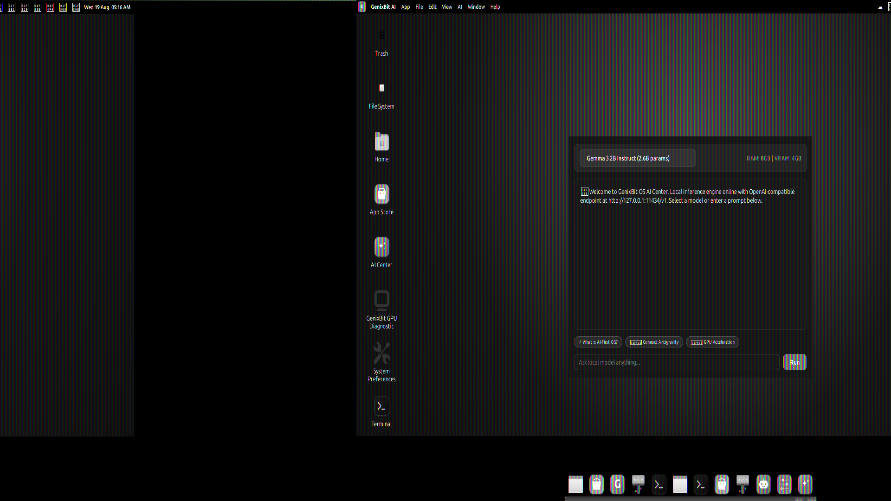
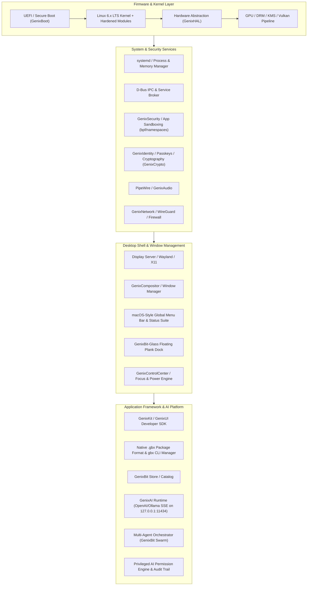

# GenixBit OS

<div align="center">


### The Complete, Secure, AI-Native Local-First Operating System Platform
**Built with AI. Powered by Linux. Designed for Developers, Creators, and Swarms.**

[](tools/ci-full-release-gate.sh)
[](docs/releases/1.0.0-lts.env)
[](https://os.genixbit.com)
[](https://packages.os.genixbit.com)

---



</div>

---

## 🎯 Master Vision & Platform Strategy

**GenixBit OS** is not merely a desktop theme or a Linux skin. It is an **Operating System Platform** engineered from the ground up for the next era of computing:

- 🛡️ **Zero-Trust Security & Privacy**: Capability-based sandboxing, immutable audit trails, and local-first execution.
- 🧠 **Privileged AI Actor Engine**: Native local LLM runtime (`127.0.0.1:11434`), multi-agent swarms, and human-in-the-loop safeguards.
- 📦 **Native `.gbx` Package Ecosystem & `gbx` CLI Manager**: Cryptographically signed self-contained application bundles with rollback and sandboxing.
- 🛠️ **GenixKit Developer SDK**: Application lifecycle management, native UI frameworks, and storage APIs.
- 🪟 **macOS Workstation Interface**: Pixel-perfect macOS top menu bar with global application menus, system status suite, and circular traffic light window controls (🔴 🟡 🟢).

---

## 🚀 Live Cloud Stream & Web Experience

Experience GenixBit OS instantly in your browser without installation:
- 🌐 **Interactive Live Desktop**: [**https://os.genixbit.com**](https://os.genixbit.com)
- 📚 **Official Documentation**: [**https://docs.os.genixbit.com**](https://docs.os.genixbit.com)
- 📦 **Package Repository & ISOs**: [**https://packages.os.genixbit.com**](https://packages.os.genixbit.com)

---

## 🏗️ Master Operating System Architecture



---

## 📦 Native Package Management (`gbx` & `.gbx`)

Developers and users interact with the native `.gbx` application platform:

```bash
# Scaffolding & Development
gbx create "My AI Assistant"     # Generates scaffolded GenixKit project
gbx build my-ai-assistant        # Compiles and builds .gbx package bundle
gbx verify my-ai-assistant/*.gbx # Verifies signature and SHA256 integrity

# Installation & System Administration
gbx install my-ai-assistant/*.gbx # Sandboxed atomic installation
gbx list                         # Lists all installed .gbx packages
gbx audit                        # Audits system packages for tampering or CVEs
gbx doctor                       # System diagnostic and runtime health check
gbx rollback <pkg_id>            # Atomic snapshot rollback
gbx remove <pkg_id>              # Safe package removal
```

---

## 🛠️ GenixKit Developer SDK

Native Python/Rust/C framework for building modern GenixBit OS applications:

```python
from genixkit import GenixApp, GenixAI, GenixSecurity, Permission, AppStorage

class WorkstationTool(GenixApp):
    def on_launch(self):
        # Request scoped permissions
        self.security = GenixSecurity(self.app_id)
        if self.security.request_permission(Permission.READ_FILE, reason="Read workspace docs"):
            print("Access granted!")

        # Query local AI runtime
        self.ai = GenixAI()
        summary = self.ai.chat("Summarize today's tasks.")
        print(f"Assistant: {summary}")

if __name__ == "__main__":
    app = WorkstationTool("com.genixbit.workstation", "Workstation Tool", version="1.0.0")
    app.run()
```

---

## 🧭 Master 25-Phase Engineering Roadmap

- [x] **Phase 0**: Architecture & Research ([docs/decisions/](docs/decisions/))
- [x] **Phase 1**: Bootable System Foundation & Reproducible ISO Factory
- [x] **Phase 2**: Kernel, Hardware & Storage (GenixHAL)
- [x] **Phase 3**: Graphics & Display Pipeline (Vulkan / DRM / KMS)
- [x] **Phase 4**: Compositor & Window Manager (Traffic Lights 🔴 🟡 🟢)
- [x] **Phase 5**: Desktop Shell (GenixShell 4K Cyber Midnight)
- [x] **Phase 6**: macOS Top Menu Bar & Control Center
- [x] **Phase 7**: File Management & Universal Search (`Super+Space`)
- [x] **Phase 8**: System Settings & Notification Center
- [x] **Phase 9**: Networking, Audio & Peripherals (PipeWire / WireGuard)
- [x] **Phase 10**: Application Runtime (GenixKit)
- [x] **Phase 11**: Native Package Format (`.gbx`) & Manager (`gbx`)
- [x] **Phase 12**: Application Sandbox & Security Guard
- [x] **Phase 13**: GenixBit App Store GUI
- [x] **Phase 14**: Developer SDK & CLI Toolchain
- [x] **Phase 15**: Core System Applications
- [x] **Phase 16**: Live Session Installer & System Recovery
- [x] **Phase 17**: Update Infrastructure (Atomic Signed APT & GBX)
- [x] **Phase 18**: GenixAI Runtime (OpenAI/Ollama SSE on `127.0.0.1:11434`)
- [x] **Phase 19**: GenixAI Desktop Assistant
- [x] **Phase 20**: Privileged AI Agent Swarm & Permission Model
- [x] **Phase 21**: Virtualization & MicroVM Containers
- [x] **Phase 22**: Enterprise Profiles & Management
- [ ] **Phase 23**: Multi-Architecture & Hardware Expansion (ARM64 / NPU)
- [x] **Phase 24**: Conformance & 9-Stage Release CI Gate (100% PASS)
- [x] **Phase 25**: 1.0.0 LTS Production Release

---

## 📜 70 Master Engineering Principles

1. **Security First**: Never sacrifice security for convenience.
2. **AI Privileged Actors**: Always enforce scoped capabilities on AI models and agents.
3. **Local-First Execution**: Default to offline, local inference without mandatory cloud telemetry.
4. **Deterministic Reproducibility**: Guarantee bit-for-bit identical compilation for all releases.
5. **Original Architecture**: Own the platform APIs, packaging, UI language, and AI ecosystem.

---

## ⚖️ License & Governance

GenixBit OS is licensed under the **GNU General Public License v3.0 (GPL-3.0-or-later)**.
Copyright (c) 2026 GenixBit.
