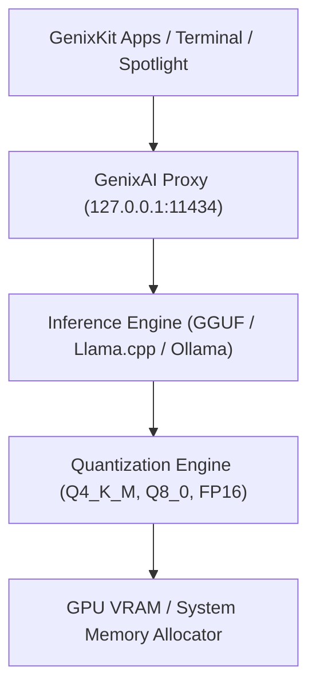

# GenixBit OS — AI Runtime & Local Model Platform (GenixAI)

## 1. Local AI Architecture
GenixAI delivers private, local-first inference across modern CPU, GPU, and NPU accelerators.

---

## 2. Supported Features
- **Local Chat & Streaming**: OpenAI & Ollama compatible REST & SSE endpoints (`/v1/chat/completions`, `/v1/models`, `/health`).
- **Embeddings & Vector Memory**: High-throughput embedding endpoint on `/v1/embeddings` for local RAG indexing.
- **Hardware Quantization Recommendation**: Dynamic inspection of GPU VRAM via `genixbit-gpu-diag` to recommend optimal quantization formats.
