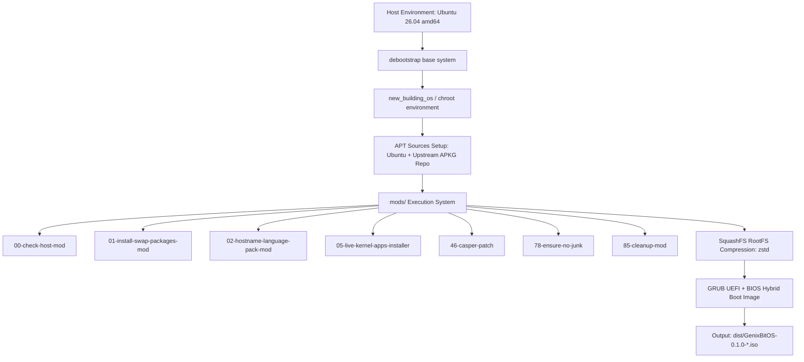

# GenixBit OS System Architecture

This document provides a technical overview of the current architecture of **GenixBit OS**, detailing how the distribution is bootstrapped, configured, packaged, and assembled into a bootable ISO image.

---

## High-Level Architecture Overview

---

## System Components

### 1. Base Operating System
- **Base Distribution**: Ubuntu Linux (`resolute` / 26.04 release base).
- **Architecture**: `amd64` (x86_64).
- **Init System**: `systemd`.
- **Boot Engine**: `casper` live-boot suite with `initramfs-tools`.

### 2. Build Pipeline (`build.sh` & `makefile`)
- **Orchestration**: `makefile` validates host dependencies and environment compatibility, delegating execution to `build.sh`.
- **Base Bootstrap**: Uses `debootstrap --variant=minbase` to pull base Ubuntu packages from official mirrors into `new_building_os/`.
- **Chroot Mounting**: Mounts host `/dev`, `/run`, `/proc`, `/sys`, and `/dev/pts` virtual filesystems into `new_building_os/`.

### 3. Modular System Customization (`mods/`)
The build process executes modular shell scripts in sequence inside the chroot environment:

* `00-check-host-mod`: Verifies root execution permissions inside chroot.
* `01-install-swap-packages-mod`: Installs overlay APT keyring and base files.
* `02-hostname-language-pack-mod`: Configures system hostname (`genixbitos`) and language packs.
* `05-live-kernel-apps-installer`: Installs Linux HWE kernel, casper live-boot components, and desktop environment metapackages.
* `46-casper-patch`: Configures `/etc/casper.conf` for live-session boot parameters.
* `78-ensure-no-junk`: Purges unwanted packages (snapd, telemetry clients, unwanted GNOME apps).
* `85-cleanup-mod`: Truncates machine-id, cleans APT caches, and removes temporary logs to minimize squashfs size.

### 4. Live ISO Generation
- **RootFS Compression**: Compresses `new_building_os/` into `image/casper/filesystem.squashfs` using `mksquashfs` with `zstd` level 19 compression.
- **Bootloader Configuration**: Generates dual BIOS (`i386-pc`) and UEFI (`x86_64-efi`) GRUB configurations.
- **ISO Creation**: Invokes `xorriso` to produce an EFI-bootable hybrid ISO image placed in `dist/`.

---

## Present vs. Future Architecture

| Subsystem | Present Architecture (`0.1.0-alpha`) | Future Architecture (`0.3.0+`) |
| :--- | :--- | :--- |
| **Package Overlay Server** | Upstream APKG server (`packages.anduinos.com`) | GenixBit Package Repository (`packages.os.genixbit.com`) |
| **GPG Archive Keyring** | `anduinos-archive-keyring.gpg` | `genixbit-os-archive-keyring.gpg` |
| **APT Configuration** | `anduinos-apt-config` | `genixbit-os-apt-config` |
| **Desktop Metapackage** | `anduinos-desktop` | `genixbit-os-desktop` |
| **System Branding** | Transitional / Pending Artwork | Official GenixBit OS Visual Identity & Themes |
| **AI Subsystem** | Manual / CLI External | Integrated Contextual AI Assistant Subsystem |
