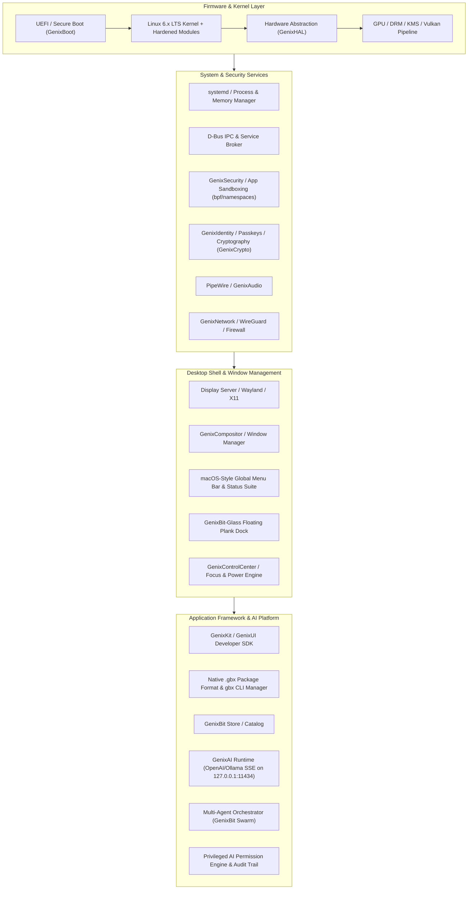

# GenixBit OS — Master Operating System Platform Architecture

GenixBit OS is a complete, secure, AI-native, local-first, enterprise-capable desktop operating system and software ecosystem.

---

## 1. Complete System Architecture Hierarchy

```mermaid
graph TD
    subgraph Foundation ["Firmware & Kernel Layer"]
        UEFI["UEFI / Secure Boot (GenixBoot)"] --> Kernel["Linux 6.x LTS Kernel + Hardened Modules"]
        Kernel --> Drivers["Hardware Abstraction (GenixHAL)"]
        Drivers --> GPU["GPU / DRM / KMS / Vulkan Pipeline"]
    end

    subgraph SystemServices ["System & Security Services"]
        Init["systemd / Process & Memory Manager"]
        Dbus["D-Bus IPC & Service Broker"]
        Security["GenixSecurity / App Sandboxing (bpf/namespaces)"]
        Identity["GenixIdentity / Passkeys / Cryptography (GenixCrypto)"]
        Audio["PipeWire / GenixAudio"]
        Net["GenixNetwork / WireGuard / Firewall"]
    end

    subgraph DesktopShell ["Desktop Shell & Window Management"]
        Display["Display Server / Wayland / X11"]
        Compositor["GenixCompositor / Window Manager"]
        TopBar["macOS-Style Global Menu Bar & Status Suite"]
        Dock["GenixBit-Glass Floating Plank Dock"]
        ControlCenter["GenixControlCenter / Focus & Power Engine"]
    end

    subgraph ApplicationEcosystem ["Application Framework & AI Platform"]
        SDK["GenixKit / GenixUI Developer SDK"]
        GBX["Native .gbx Package Format & gbx CLI Manager"]
        Store["GenixBit Store / Catalog"]
        AIProxy["GenixAI Runtime (OpenAI/Ollama SSE on 127.0.0.1:11434)"]
        Swarm["Multi-Agent Orchestrator (GenixBit Swarm)"]
        AIGuard["Privileged AI Permission Engine & Audit Trail"]
    end

    Foundation --> SystemServices
    SystemServices --> DesktopShell
    DesktopShell --> ApplicationEcosystem
```

---

## 2. Core Subsystems

### 2.1 Kernel & Hardware Strategy (GenixHAL)
- **Foundation**: Linux 6.x LTS with hardened sysctl configurations and minimal attack surface.
- **Hardware Targets**: Workstations, Laptops, Desktops, Virtual Machines (x86_64 and ARM64).
- **GPU Acceleration**: Direct DRM/KMS, Vulkan, and Mesa acceleration with multi-monitor and HiDPI scaling.

### 2.2 Native Package Format (`.gbx`) & Package Manager (`gbx`)
- **Package Container**: Signed tarball containing `manifest.json`, signature, data payload, and icons.
- **Sandboxing Metadata**: Capability declarations (`files`, `network`, `camera`, `ai_runtime`, `gpu`).
- **CLI Commands**:
  - `gbx install`, `gbx remove`, `gbx update`, `gbx list`, `gbx info`
  - `gbx verify`, `gbx sign`, `gbx audit`, `gbx doctor`, `gbx rollback`
  - `gbx create`, `gbx build`, `gbx publish`

### 2.3 GenixKit & GenixUI Developer SDK
- Standardized developer framework supporting:
  - Application Lifecycle events (`on_launch`, `on_suspend`, `on_resume`, `on_terminate`)
  - AI API integration with local LLM models (`chat`, `stream_chat`, `embeddings`)
  - Capability-based permission negotiation
  - Sandboxed data persistence (`AppStorage`)

### 2.4 Privileged AI Actor Permission Architecture
- Granular capability engine:
  - `READ_FILE`, `WRITE_FILE`, `EXECUTE_COMMAND`, `NETWORK_REQUEST`, `SCREEN_CAPTURE`, `ACCESS_CAMERA`, `ACCESS_MICROPHONE`, `CHANGE_SETTING`.
  - Immutable audit trail recorded to `~/.local/share/genixbit/audit/ai_permissions.jsonl`.
  - Interactive user confirmation for high-risk operations.

### 2.5 Desktop Shell & User Interface
- **Top Menu Bar**: `[ G ]` System Menu, Global App Menus (`App`, `File`, `Edit`, `View`, `AI`, `Window`, `Help`), and complete macOS Status Suite (`☁️`, `✨`, `🛡️`, `🌙`, `🔋`, `📶`, `🔍`, `🎛️`, Clock).
- **Window Management**: Left-aligned macOS Traffic Light Controls (🔴 `#ff5f56`, 🟡 `#ffbd2e`, 🟢 `#27c93f`).
- **Dock**: Centered Frosted Glass Capsule (`GenixBit-Glass`) with active glowing indicators.
