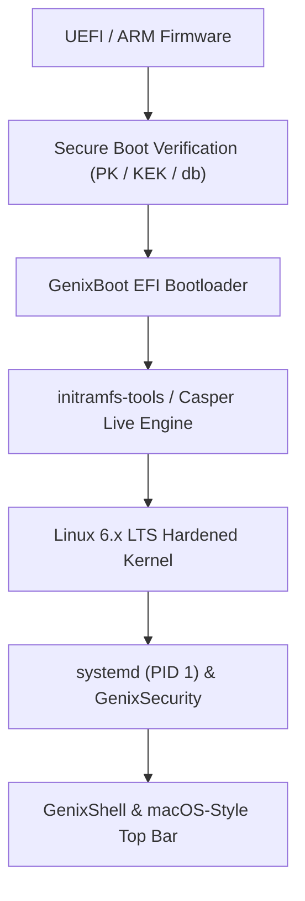

# GenixBit OS — Boot & Firmware Architecture (GenixBoot)

## 1. Overview
GenixBoot manages firmware handoff, Secure Boot verification, and kernel initialization across x86_64 and ARM64 platforms.

---

## 2. Boot Pipeline

---

## 3. Supported Boot Modes
- **UEFI 64-bit (`x86_64-efi`)**: Native GPT partitioning with standard ESP boot.
- **ARM64 UEFI (`aarch64-efi`)**: Standard device tree and ACPI handoff.
- **Legacy BIOS (`i386-pc`)**: Dual-mode MBR/GPT hybrid compatibility for vintage workstations.
