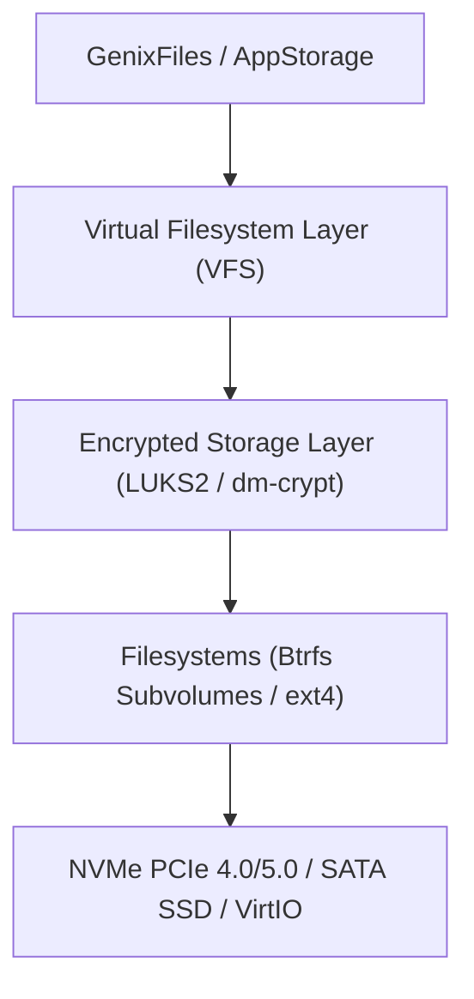

# GenixBit OS — Storage & Filesystem Architecture (GenixStorage)

## 1. Storage & Filesystem Hierarchy
GenixBit OS leverages a high-throughput, secure storage architecture with support for Btrfs, ext4, and ZFS.

---

## 2. Directory Layout & Sandbox Paths
- `/usr/lib/genixbit-os/`: System platform libraries, SDK, and AI components.
- `~/.local/share/genixbit/apps/`: Sandboxed `.gbx` application installations.
- `~/.local/share/genixbit/app-data/<app_id>/`: Per-application isolated storage.
- `~/.local/share/genixbit/audit/`: Immutable security and AI permission audit logs.
- `/etc/genixbit/`: System-wide configuration and platform specifications.
