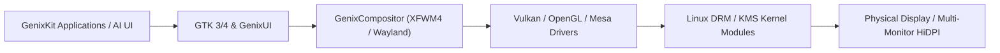

# GenixBit OS — Graphics & Display Pipeline (GenixGraphics)

## 1. Graphics Subsystem
GenixBit OS leverages direct Linux DRM/KMS, Mesa 3D, and Vulkan acceleration pipelines.

---

## 2. Capabilities
- **Direct GPU Acceleration**: High-performance hardware rasterization for NVIDIA, AMD, and Intel Arc GPUs.
- **HiDPI Scaling**: Crisp vector scaling across 1080p, 1440p, 4K, and ultra-wide displays.
- **Glassmorphism & Blurs**: Real-time translucent window titlebars and floating dock blur effects.
