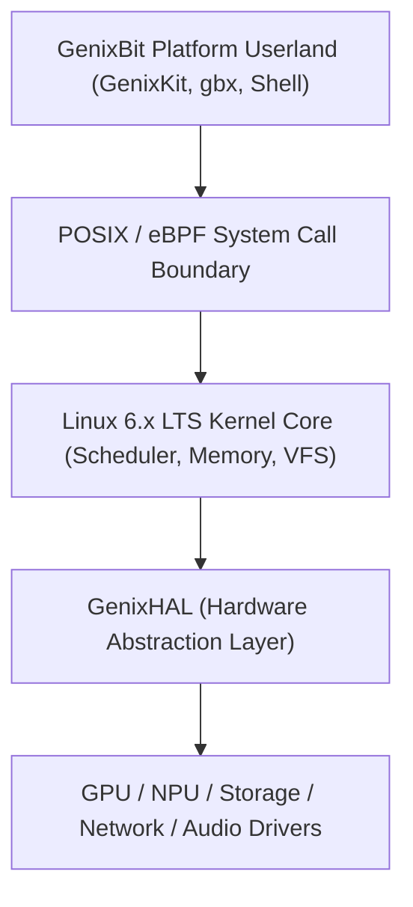

# GenixBit OS — Kernel & Hardware Abstraction Layer (GenixHAL)

## 1. Kernel Architecture
GenixBit OS utilizes a Linux 6.x LTS enterprise foundation combined with an original GenixBit Platform Layer.

---

## 2. Hardened Kernel Parameters
- Kernel address space layout randomization (`kASLR` enabled).
- User namespace isolation and seccomp-bpf system call filters.
- Restricted dmesg and ptrace access (`kernel.dmesg_restrict=1`, `kernel.yama.ptrace_scope=2`).
- Hardened memory allocators with slab freelist randomization.
