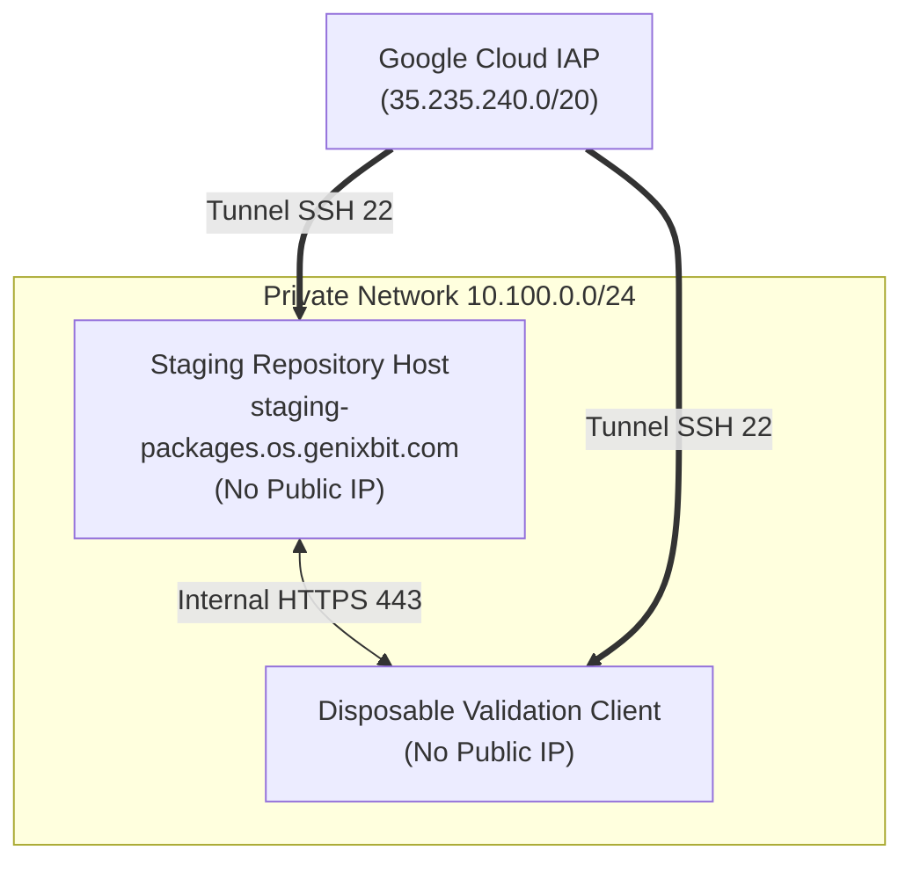

# GenixBit OS Package Staging Deployment Guide

This document defines the deployment architecture, configuration, and step-by-step procedures for provisioning the **GenixBit OS Staging Package Repository Environment**.

---

## 1. Architecture Overview

The staging package infrastructure provides a fully isolated, access-restricted environment to validate Debian package hosting, signing, snapshotting, promotion, and client installation over a real network connection before any production infrastructure is provisioned.



---

## 2. Infrastructure Specifications

1. **VPC Network**: Isolated private subnet (`10.100.0.0/24`), auto-subnets disabled.
2. **Network Isolation**: Zero public IP addresses assigned to compute instances.
3. **Ingress Controls**:
   - Administrative SSH permitted exclusively via **Google Cloud IAP** (`35.235.240.0/20`).
   - Internal HTTPS (`443`/`8443`) permitted exclusively between validation client and repository host.
4. **Encryption**: Persistent boot disks encrypted with GCP KMS / customer-managed encryption keys.
5. **Storage & Evidence**: Private Cloud Storage bucket (`genixbit-staging-evidence-*`) with 30-day lifecycle deletion rule.
6. **Domain Name**: Dedicated staging hostname `staging-packages.os.genixbit.com` (or internal DNS `staging-packages.genixbit.internal`).

---

## 3. Operator Deployment Steps

> [!CAUTION]
> Cloud infrastructure deployment must be initiated manually by authorized operators. GitHub Actions CI does **NOT** automatically deploy cloud infrastructure on pull requests.

```bash
# 1. Authenticate with Google Cloud
gcloud auth login
gcloud config set project <STAGING_PROJECT_ID>

# 2. Change to infrastructure directory
cd infra/package-staging

# 3. Initialize and validate OpenTofu / Terraform configuration
tofu init || terraform init
tofu validate || terraform validate

# 4. Create tfvars file for staging execution
cp terraform.tfvars.example terraform.tfvars

# 5. Apply infrastructure configuration
tofu apply || terraform apply
```

---

## 4. Current Deployment Status

If an authenticated GCP project or required configuration (billing account, DNS zone) is unconfigured or unavailable, deployment halts safely with status `BLOCKED_GCP_STAGING_CONFIGURATION_MISSING`.

- **Staging Infrastructure Code**: `PASS`
- **Staging Infrastructure Deployed**: `NOT_DEPLOYED` (`BLOCKED_GCP_STAGING_CONFIGURATION_MISSING`)
- **Production Signing Key**: `NOT_CREATED`
- **Production Repository**: `NOT_DEPLOYED`
- **AnduinOS Migration**: `NOT_STARTED`
