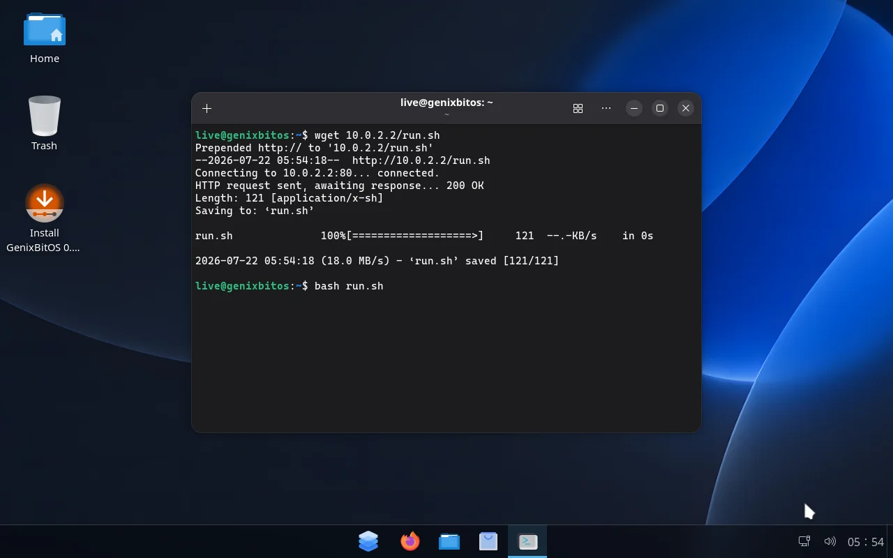
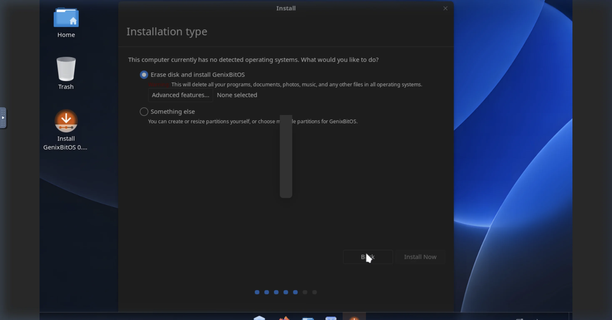
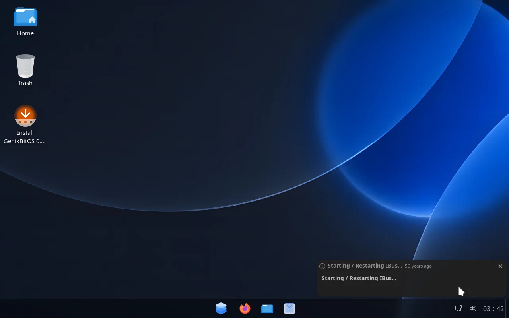
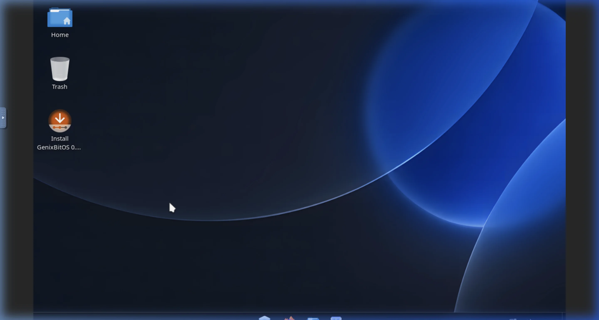
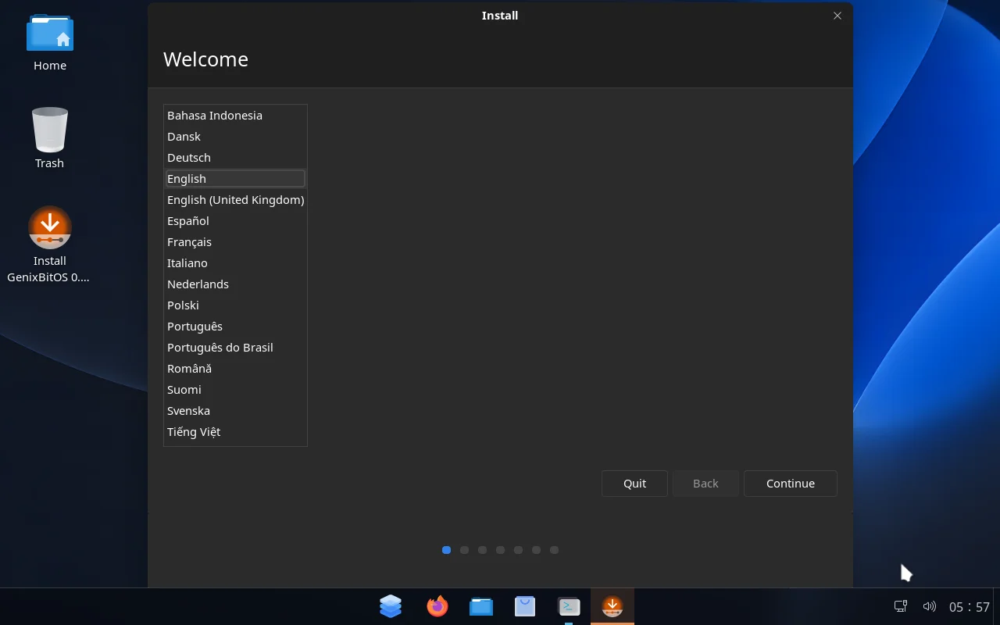
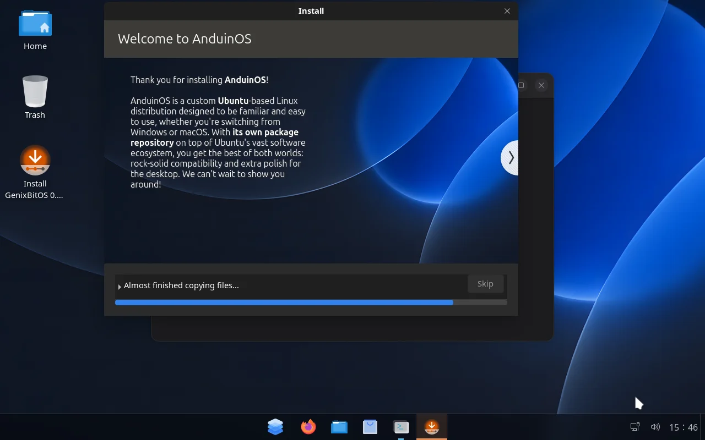
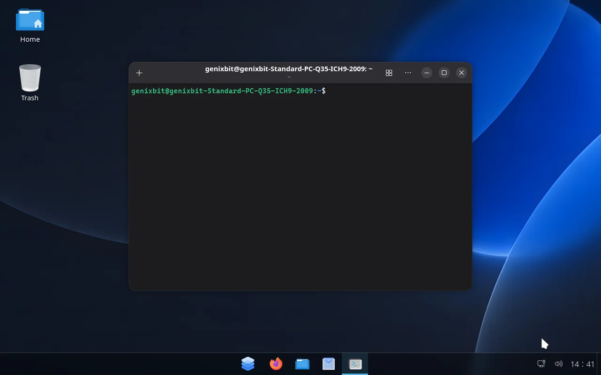
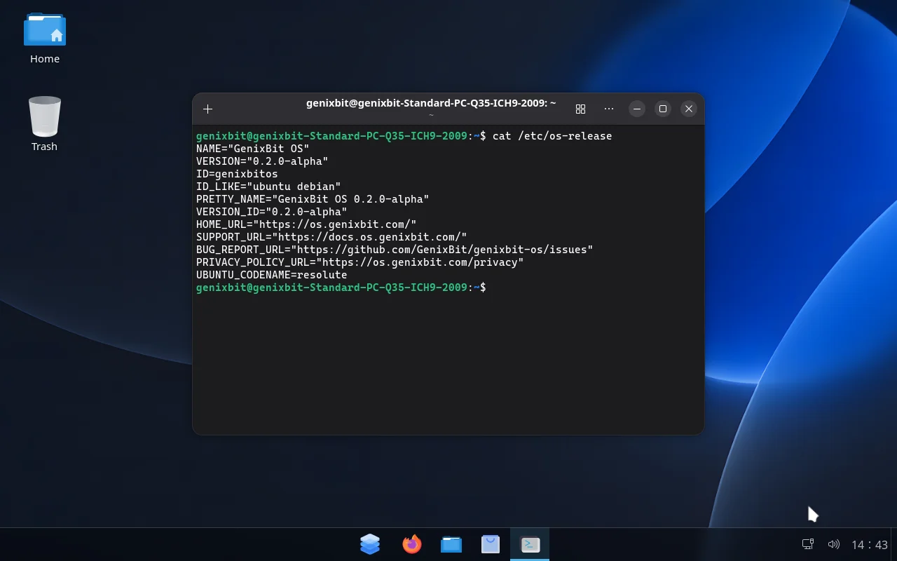

# GenixBit OS 0.2.0-alpha Release Screenshots

## Summary & Provenance

All screenshots in this gallery represent direct visual evidence captured interactively from **GenixBit OS 0.2.0-alpha Candidate 2** (Candidate SHA `88a1550a9129a80ffd2c4cf73838122020a782cb`, ISO `GenixBitOS-0.2.0-alpha-2607220558.iso`).

No screens were simulated, redrawn, or altered with artificial UI elements. High-resolution raw PNG captures remain retained in the private release validation evidence bundle outside Git.

---

## Screen Gallery & Metadata

### 1. Legacy BIOS Boot Screen

| Field | Value |
| --- | --- |
| Surface | BIOS Boot & SeaBIOS initialization |
| Candidate SHA | `88a1550a9129a80ffd2c4cf73838122020a782cb` |
| ISO Filename | `GenixBitOS-0.2.0-alpha-2607220558.iso` |
| Boot Mode | Legacy BIOS (SeaBIOS) |
| System Mode | Live Session / Bootloader |
| Validation Result | **PASS** |
| Privacy Edits | None |
| Retained Private Evidence | `bios_step1.png` in evidence bundle |
| Known Limitation | Resolution initialized at default VESA 800x600 before kernel mode setting |

---

### 2. UEFI Bootloader & Boot Menu

| Field | Value |
| --- | --- |
| Surface | UEFI Boot Initialization & GRUB menu |
| Candidate SHA | `88a1550a9129a80ffd2c4cf73838122020a782cb` |
| ISO Filename | `GenixBitOS-0.2.0-alpha-2607220558.iso` |
| Boot Mode | UEFI (OVMF firmware) |
| System Mode | Live Session / Bootloader |
| Validation Result | **PASS** |
| Privacy Edits | None |
| Retained Private Evidence | `uefi_vnc_initial_1784620403924.png` in evidence bundle |
| Known Limitation | GRUB theme uses standard fallback font before X11 graphics load |

---

### 3. Live Desktop Environment

| Field | Value |
| --- | --- |
| Surface | Live Desktop Session & Dock |
| Candidate SHA | `88a1550a9129a80ffd2c4cf73838122020a782cb` |
| ISO Filename | `GenixBitOS-0.2.0-alpha-2607220558.iso` |
| Boot Mode | UEFI |
| System Mode | Live Session |
| Validation Result | **PASS** |
| Privacy Edits | None |
| Retained Private Evidence | `uefi_boot_fresh.png` in evidence bundle |
| Known Limitation | Temporary upstream package repository icons remain pending Phase 3 APT setup |

---

### 4. GenixBit Desktop Wallpaper & Icons

| Field | Value |
| --- | --- |
| Surface | Desktop Wallpaper & Launcher Icon |
| Candidate SHA | `88a1550a9129a80ffd2c4cf73838122020a782cb` |
| ISO Filename | `GenixBitOS-0.2.0-alpha-2607220558.iso` |
| Boot Mode | UEFI |
| System Mode | Live Session |
| Validation Result | **PASS** |
| Privacy Edits | None |
| Retained Private Evidence | `live_desktop_booted_1784618685976.png` in evidence bundle |
| Known Limitation | Desktop launcher icon uses transparent GenixBit GB monogram |

---

### 5. Installer Welcome & Setup

| Field | Value |
| --- | --- |
| Surface | Installer Welcome & Language Selection |
| Candidate SHA | `88a1550a9129a80ffd2c4cf73838122020a782cb` |
| ISO Filename | `GenixBitOS-0.2.0-alpha-2607220558.iso` |
| Boot Mode | Legacy BIOS |
| System Mode | Live Session / Installer |
| Validation Result | **PASS** |
| Privacy Edits | None |
| Retained Private Evidence | `bios_step2.png` in evidence bundle |
| Known Limitation | Installer theme inherits default system dark theme styling |

---

### 6. Installation Progress & Slideshow

| Field | Value |
| --- | --- |
| Surface | Installer Progress & File Copying |
| Candidate SHA | `88a1550a9129a80ffd2c4cf73838122020a782cb` |
| ISO Filename | `GenixBitOS-0.2.0-alpha-2607220558.iso` |
| Boot Mode | Legacy BIOS |
| System Mode | Live Session / Installer |
| Validation Result | **PASS** |
| Privacy Edits | None |
| Retained Private Evidence | `bios_install_progress.png` in evidence bundle |
| Known Limitation | Upstream slideshow package retains legacy slideshow text pending Phase 3 packaging |

---

### 7. Installed Target System Desktop

| Field | Value |
| --- | --- |
| Surface | Installed System Desktop & Terminal |
| Candidate SHA | `88a1550a9129a80ffd2c4cf73838122020a782cb` |
| ISO Filename | `GenixBitOS-0.2.0-alpha-2607220558.iso` |
| Boot Mode | UEFI |
| System Mode | Installed System |
| Validation Result | **PASS** |
| Privacy Edits | Cleared terminal prompt history; no private user data visible |
| Retained Private Evidence | `installed_terminal_open.png` in evidence bundle |
| Known Limitation | Boots directly from target virtual disk `/dev/vda` without live ISO |

---

### 8. System Identity & OS Release Settings

| Field | Value |
| --- | --- |
| Surface | System Identity & `/etc/os-release` |
| Candidate SHA | `88a1550a9129a80ffd2c4cf73838122020a782cb` |
| ISO Filename | `GenixBitOS-0.2.0-alpha-2607220558.iso` |
| Boot Mode | UEFI |
| System Mode | Installed System |
| Validation Result | **PASS** |
| Privacy Edits | None |
| Retained Private Evidence | `os_release.png` in evidence bundle |
| Known Limitation | Confirms `PRETTY_NAME="GenixBit OS 0.2.0-alpha"` and `VERSION_ID="0.2.0-alpha"` |
