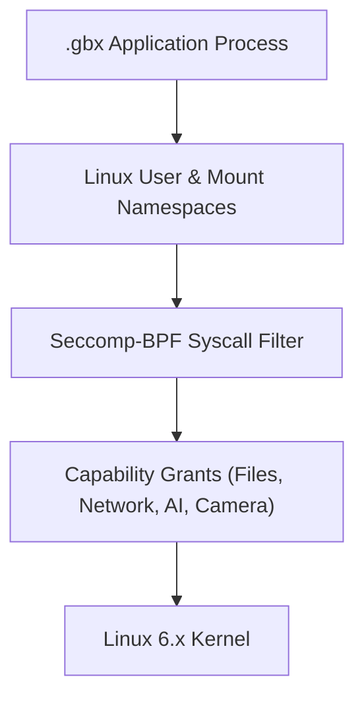

# GenixBit OS — Application Sandbox Architecture (GenixSandbox)

## 1. Sandbox Model
Applications run with least privilege using Linux user namespaces, cgroups v2 resource limits, and seccomp-bpf system call filters.

---

## 2. Capability Permissions
- `files`: Read/write access restricted to app-specific data directory (`~/.local/share/genixbit/app-data/<app_id>`).
- `network`: Outbound network access.
- `camera` / `microphone`: Multimedia hardware streaming.
- `ai_runtime`: Access to local LLM inference proxy on `127.0.0.1:11434`.
- `gpu`: Direct DRI/DRM hardware rendering acceleration.
