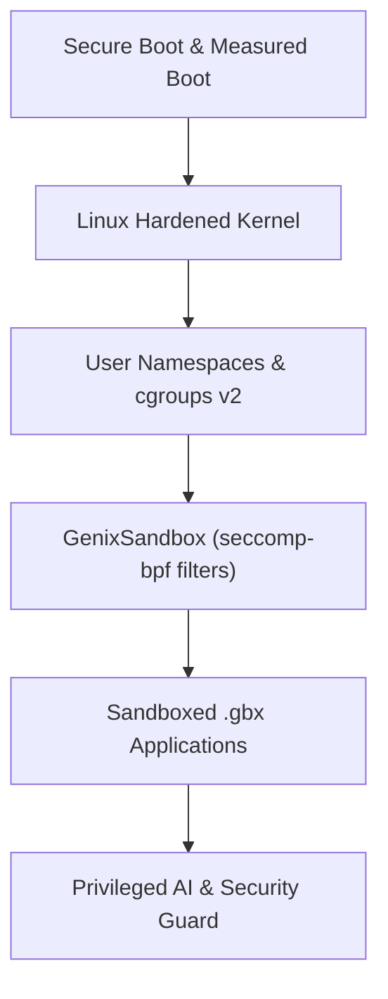

# GenixBit OS — Platform Security Architecture (GenixSecurity)

## 1. Security Architecture
GenixBit OS is designed with defense-in-depth across the kernel, userland daemons, and application sandbox.

---

## 2. Key Safeguards
1. **Zero-Trust AI Guard**: Scoped permissions (`READ_FILE`, `WRITE_FILE`, `EXECUTE_COMMAND`, `NETWORK_REQUEST`) with interactive confirmation.
2. **Cryptographic Integrity**: Ed25519 digital signatures and SHA-256 hashes on all `.deb` and `.gbx` packages.
3. **App Sandboxing**: Bubblewrap / user namespace isolation restricting filesystem, IPC, and network access.
4. **Immutable Audit Logs**: Append-only JSONL logging at `~/.local/share/genixbit/audit/`.
