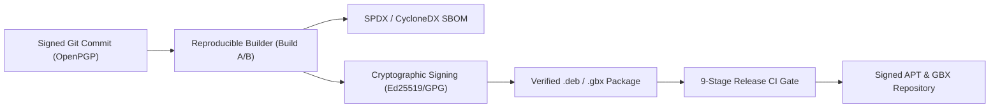

# GenixBit OS — Software Supply Chain & Integrity Specification

## 1. Supply Chain Architecture
GenixBit OS enforces strict software supply chain security aligned with NIST SP 800-218, OpenSSF Best Practices, and SLSA (Supply-chain Levels for Software Artifacts) Level 3.

---

## 2. Key Requirements & Standards
1. **Signed Releases**: Every git release tag is cryptographically signed with passphrase-protected developer keys.
2. **Deterministic Reproducibility**: Builds must compile bit-for-bit identical installation media and `.deb`/`.gbx` packages regardless of build timestamp or environment.
3. **Software Bill of Materials (SBOM)**:
   - Machine-readable SPDX v2.3 and CycloneDX v1.5 SBOM generated during build.
   - Comprehensive inventory of all licenses, copyright holders, hashes, and upstream sources.
4. **Binary Provenance & Attestation**:
   - In-toto metadata recording build environment, toolchain versions, and source commit hashes.
   - Fail-closed enforcement on missing or mismatched package digests.
