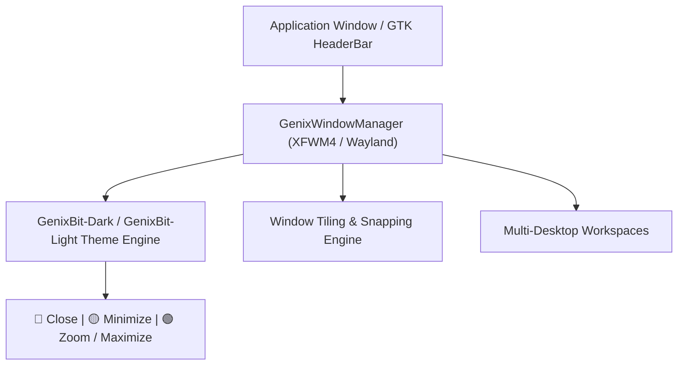

# GenixBit OS — Window Manager & Compositor Architecture (GenixWindowManager)

## 1. Architecture
GenixWindowManager provides a hardware-accelerated, glassmorphic desktop environment with authentic left-aligned macOS traffic light controls:

---

## 2. Window Controls Specification
- **🔴 Close Button (`#ff5f56`)**: Closes application window, displaying `x` glyph on hover.
- **🟡 Minimize Button (`#ffbd2e`)**: Minimizes window to floating dock, displaying `-` glyph on hover.
- **🟢 Zoom / Maximize (`#27c93f`)**: Toggles fullscreen / zoom state, displaying `+` glyph on hover.

---

## 3. Window Snapping & Shortcuts
- `Super + Left`: Tile active window to the left half of the screen.
- `Super + Right`: Tile active window to the right half of the screen.
- `Super + Up`: Maximize window.
- `Super + Down`: Restore or minimize window.
