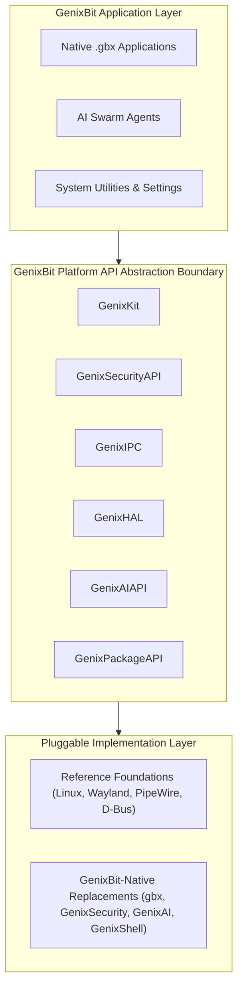

# GenixBit OS — Component Replacement & Platform Ownership Matrix

## 1. Executive Strategy
GenixBit OS enforces a strict **Three-Layer Architecture**:
1. **GenixBit Application Layer**: Applications, tools, and developer agents.
2. **GenixBit Platform API Layer**: Immutable system contracts (`GenixKit`, `GenixSecurity`, `GenixHAL`, `GenixIPC`, `GenixDisplayAPI`).
3. **Implementation & Foundation Layer**: Pluggable backends (Reference open-source implementations or GenixBit-native replacements).

Applications communicate exclusively through GenixBit Platform APIs. Any backend component can be swapped, forked, or replaced with a native engine without breaking application-level compatibility.

---

## 2. Four Component Strategies
- **A. USE**: Mature, secure reference technology used as-is.
- **B. WRAP**: Enclose reference technology in a GenixBit abstraction API.
- **C. FORK / MODIFY**: Fork open-source project to extend security, performance, or UI integration.
- **D. REPLACE**: Build a completely GenixBit-native implementation.

---

## 3. Subsystem Replacement Matrix

| Subsystem | Initial Reference Technology | GenixBit API Boundary | Strategy | Timing | Long-Term GenixBit-Native Option |
| :--- | :--- | :--- | :--- | :--- | :--- |
| **Kernel** | Linux 6.x LTS Hardened | `GenixKernelAPI` | **WRAP** | LATER | `GenixKernel` (Microkernel / Capability OS) |
| **Hardware Abstraction** | udev / sysfs / libdrm | `GenixHAL` | **WRAP / EXTEND** | NOW | `GenixHAL Runtime` |
| **Compositor & Display** | X11 / Wayland (DRM/KMS) | `GenixDisplayAPI` | **WRAP** | LATER | `GenixDisplayServer` |
| **Window Management** | XFWM4 / libmutter | `GenixWindowAPI` | **MODIFY / EXTEND**| NOW | `GenixWindowManager` |
| **Desktop Shell** | GTK3/4 / Cairo | `GenixShell` | **REPLACE** | NOW | `GenixShell` (Native Cyber Glass) |
| **Package Management** | dpkg / apt / Flatpak | `GenixPackageAPI` | **REPLACE** | NOW | `gbx` & `.gbx` Native Package Ecosystem |
| **App Sandboxing** | bubblewrap / seccomp-bpf | `GenixSandboxAPI` | **WRAP** | NOW | `GenixSandbox` (Capability-Isolated Jail) |
| **Inter-Process Comm (IPC)** | D-Bus / Unix Domain Sockets | `GenixIPC` | **WRAP** | LATER | `GenixIPC` (Zero-Copy Shared Memory IPC) |
| **System Services** | systemd / SysV init | `GenixServiceManagerAPI`| **WRAP** | LATER | `GenixServiceManager` |
| **Audio Engine** | PipeWire / ALSA | `GenixAudioAPI` | **WRAP** | LATER | `GenixAudioEngine` (Low-Latency Realtime) |
| **Bluetooth Subsystem** | BlueZ 5.75 | `GenixBluetoothAPI` | **WRAP** | LATER | `GenixBluetooth` |
| **Network & VPN** | NetworkManager / WireGuard | `GenixNetworkAPI` | **WRAP / EXTEND** | NOW | `GenixNetworkManager` & `GenixMeshVPN` |
| **Storage & Filesystem** | Btrfs / ext4 / ZFS | `GenixStorageAPI` | **WRAP** | LATER | `GenixFS` (Atomic Copy-On-Write Storage) |
| **AI Runtime** | Ollama / Llama.cpp / GGUF | `GenixAIAPI` | **WRAP / EXTEND** | NOW | `GenixAI Runtime` (127.0.0.1:11434) |
| **AI Security Guard** | Append-only JSONL / PAM | `GenixSecurityAPI` | **REPLACE** | NOW | `GenixSecurity` (Privileged AI Actor Guard)|
| **Multi-Agent Swarm** | Autonomous Local Daemons | `GenixAgentAPI` | **REPLACE** | NOW | `GenixAgent` (`genixbit-swarm`) |
| **Virtualization & MicroVM**| QEMU / KVM | `GenixVirtualizationAPI`| **WRAP** | NOW | `GenixMicroVM` |
| **Container Engine** | containerd / OCI runc | `GenixContainersAPI` | **WRAP** | LATER | `GenixContainers` |
| **Developer SDK** | Python / Rust / C++ | `GenixKit` | **REPLACE** | NOW | `GenixKit` Platform SDK |
| **Identity & Passkeys** | Hardware Keystore / PAM | `GenixIdentityAPI` | **WRAP / EXTEND** | NOW | `GenixIdentity` |

---

## 4. Migration Architecture Flow

