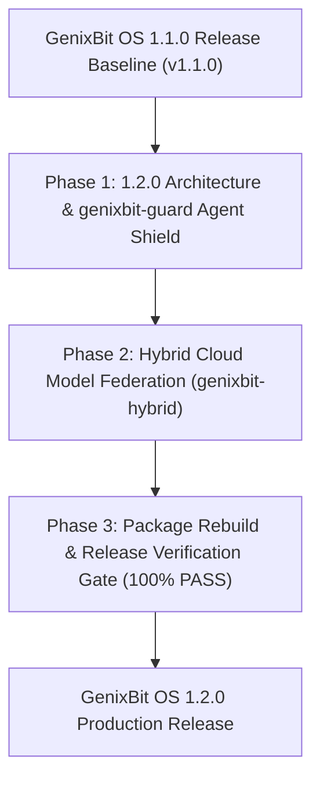

# GenixBit OS 1.2.0 Engineering Roadmap
**Codename**: *Kavach* (Armor / Security & Federation)  
**Target Release**: Q3/Q4 2026  
**Base Distribution**: Ubuntu 26.04 Resolute LTS  
**Primary Focus**: Autonomous Agent Security Guard, Hybrid Cloud Model Federation, and Zero-Trust Execution.

---

## 1. Executive Summary

GenixBit OS 1.0.0 delivered a deterministic LTS production foundation, and 1.1.0 (*Shakti*) delivered local multilingual AI (Bharat AI), offline voice intelligence, LAN compute mesh clustering, and native desktop GUIs.

**GenixBit OS 1.2.0 (*Kavach*)** elevates workstation defense and multi-model scaling by introducing:
1. **`genixbit-guard`**: Real-time agent sandbox protection, prompt injection filtering, and file mutation guardrails.
2. **`genixbit-hybrid`**: Intelligent hybrid model federation routing between zero-telemetry local inference and high-parameter cloud reasoning engines.
3. **Advanced Memory Compaction**: Kernel ZRAM dynamic swap sizing for handling large 32B/70B quantizations.

---

## 2. Core Pillars of Version 1.2.0

### Pillar 1: Autonomous Agent Security Guard (`genixbit-guard`)
- **Sandboxed Execution**: Runs untrusted AI agent shell scripts in isolated Linux namespaces (`unshare -m -n -p`).
- **Prompt Injection Defense**: Scans incoming developer prompts and agent directives against adversarial jailbreaks.
- **Audit Logging**: Structured JSON security event logs stored in `~/.local/state/genixbit/guard.log`.

### Pillar 2: Hybrid Cloud Model Federation (`genixbit-hybrid`)
- **Dynamic Routing Policy**:
  - `strict-local`: 100% offline, zero cloud egress (Default).
  - `cost-optimized`: Small prompts on local GPU/NPU; heavy code synthesis to cloud.
  - `quality-first`: Complex multi-step reasoning queries cloud LLMs; fast completions run locally.
- **Unified OpenAI Endpoint**: Single entrypoint on `http://127.0.0.1:11434/v1` handles automatic routing transparently.

### Pillar 3: ZRAM & Memory Compaction Optimization
- Dynamically allocates ZRAM compressed swap space (up to 50% of physical RAM) with `lz4` compression algorithm to prevent Out-Of-Memory kills during large model KV-cache expansion.

---

## 3. Milestone Phases & Release Timeline

