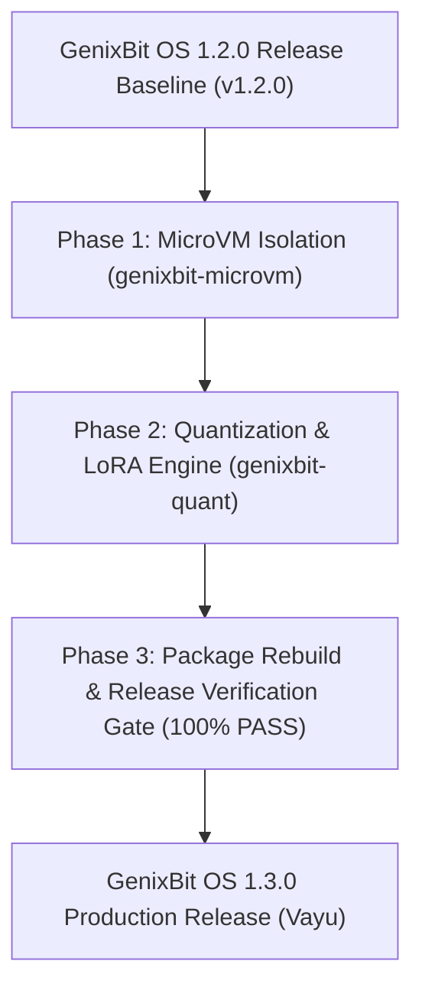

# GenixBit OS 1.3.0 Engineering Roadmap
**Codename**: *Vayu* (Velocity / Ultra-Low-Latency Edge AI & MicroVM Isolation)  
**Target Release**: Q4 2026 / Q1 2027  
**Base Distribution**: Ubuntu 26.04 Resolute LTS  
**Primary Focus**: MicroVM Hardware Sandboxing, On-Device GGUF Quantization, and Dynamic LoRA Adapter Management.

---

## 1. Executive Summary

Building upon 1.1.0 (*Shakti* - Multilingual & Mesh) and 1.2.0 (*Kavach* - Security & Federation), **GenixBit OS 1.3.0 (*Vayu*)** delivers high-velocity edge execution and micro-virtualization.

### Key Capabilities in 1.3.0:
1. **`genixbit-microvm`**: Sub-second (<120ms) hardware-isolated virtual machines powered by Firecracker/KVM for running agent operations without touching host OS storage.
2. **`genixbit-quant`**: Native on-device GGUF quantizer and real-time LoRA adapter loader for dynamic task-specific fine-tuning.
3. **Edge Optimization**: Zero-latency prompt token streaming on low-power ARM64 and x86_64 devices.

---

## 2. Core Pillars of Version 1.3.0

### Pillar 1: MicroVM Agent Virtualization (`genixbit-microvm`)
- Spawns lightweight Linux MicroVMs with dedicated memory and vCPUs.
- Ephemeral root filesystem discarded immediately after agent task completion.
- Complete hardware boundary isolation (KVM hypervisor level).

### Pillar 2: Dynamic LoRA Adapters & Quantization (`genixbit-quant`)
- Real-time hot-swapping of LoRA weights onto base models (Gemma 3, IndicLLM, Qwen 3).
- On-the-fly model quantization (FP16 -> Q8_0, Q4_K_M, Q2_K) to maximize VRAM fit.

---

## 3. Milestone Timeline

