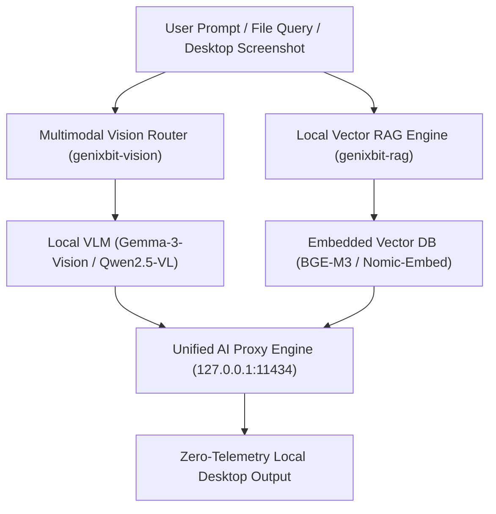

# GenixBit OS 1.4.0 Engineering Roadmap
**Codename**: *Drishti* (Vision / Multimodal Perception, Local RAG & Edge NPU Pipeline)  
**Target Release**: Q1 2027  
**Base Distribution**: Ubuntu 26.04 Resolute LTS  
**Primary Focus**: Multimodal Vision Perception, Offline Multimodal Vector RAG, and NPU Accelerated Tensor Processing.

---

## 1. Executive Summary

Building upon versions 1.1.0 (*Shakti*), 1.2.0 (*Kavach*), and 1.3.0 (*Vayu*), **GenixBit OS 1.4.0 (*Drishti*)** equips developers with full on-device visual intelligence and local knowledge retrieval.

### Key Capabilities in 1.4.0:
1. **`genixbit-vision`**: Real-time multimodal vision inference for screen understanding, diagram interpretation, OCR, and camera perception using local vision-language models (e.g., Gemma-3-Vision, Qwen2.5-VL, LLaVA).
2. **`genixbit-rag`**: Zero-cloud document indexing and retrieval-augmented generation engine with hybrid dense/sparse vector search.
3. **NPU Pipeline Acceleration**: Direct offloading of vision convolutions and vector cosine similarity math to dedicated Neural Processing Units (NPUs) and tensor cores.

---

## 2. Architecture & Workflows

