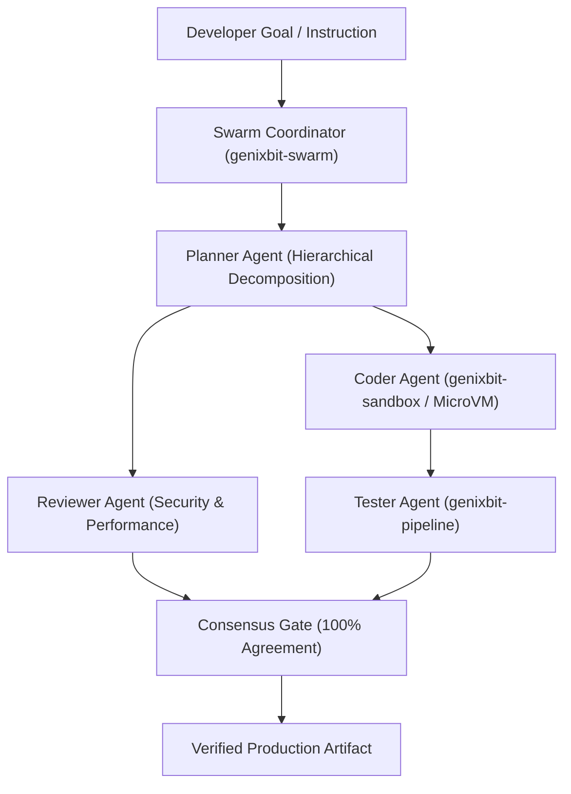

# GenixBit OS 1.5.0 Engineering Roadmap
**Codename**: *Sutra* (Thread / Autonomous Multi-Agent Swarm & Local AI Pipeline Engine)  
**Target Release**: Q2 2027  
**Base Distribution**: Ubuntu 26.04 Resolute LTS  
**Primary Focus**: Multi-Agent Swarm Orchestration, Hierarchical Workflow Consensus, and Local AI CI/CD Automation.

---

## 1. Executive Summary

Building upon versions 1.1.0 (*Shakti*), 1.2.0 (*Kavach*), 1.3.0 (*Vayu*), and 1.4.0 (*Drishti*), **GenixBit OS 1.5.0 (*Sutra*)** introduces autonomous multi-agent swarm collaboration and native pipeline execution.

### Key Capabilities in 1.5.0:
1. **`genixbit-swarm`**: Coordinates heterogeneous agent roles (Planner, Architect, Coder, Reviewer, Tester) across isolated MicroVMs and local LLMs.
2. **`genixbit-pipeline`**: Automates multi-stage offline CI/CD workflows, automated pull request generation, and test-driven code self-healing.
3. **Consensus Protocols**: Majority voting and peer review gates ensuring zero hallucinations in critical systems code.

---

## 2. Swarm Architecture

